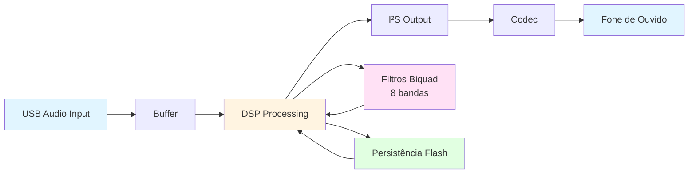

# Processador de Áudio e Otimizador de Fones de Ouvido Independente

Este projeto implementa um dispositivo autônomo capaz de processar e otimizar sinais de áudio provenientes de notebooks e celulares quando conectados a fones de ouvido. O dispositivo funciona como um dispositivo USB Audio Class, interceptando o sinal de áudio digital e aplicando processamento digital de sinais (DSP) antes da conversão analógica final.

## Descrição

O projeto visa reduzir gargalos no processo de entrega de áudio, desde o envio em formato digital pelo dispositivo transmissor até a fase final analógica entregue ao fone de ouvido. Sua principal funcionalidade está na melhoria da qualidade de som entregue a fones de ouvido de entrada e média qualidade, sem a necessidade de utilização de equipamentos de alto custo.

### Características Principais

- **Dispositivo USB Audio Class**: Funciona como dispositivo de áudio USB autônomo, sem necessidade de drivers específicos
- **Processamento Digital de Sinais**: Aplica filtros biquad para equalização personalizada
- **Interface Touchscreen**: Permite ajuste visual e interativo dos parâmetros de equalização
- **Persistência de Configurações**: Salva as configurações de equalização na memória flash
- **8 Bandas de Equalização**: Sistema de equalização com 8 bandas ajustáveis
- **Alta Qualidade**: Conversão e amplificação de alta qualidade para melhor fidelidade sonora

## Hardware

O projeto foi desenvolvido para a placa de desenvolvimento **STM32F769I-Discovery**, que possui:

- **Microcontrolador**: STM32F769NIH6 (ARM Cortex-M7, 216 MHz)
- **Display LCD**: Tela touchscreen integrada
- **Áudio**: Codec WM8994 integrado
- **USB**: Interface USB OTG FS/HS
- **Memória Flash**: Para persistência de configurações

## Estrutura do Projeto

```
.
├── Application/
│   ├── DSP/                    # Processamento Digital de Sinais
│   │   ├── Inc/
│   │   │   └── audio_user_dsp.h
│   │   └── Src/
│   │       └── audio_user_dsp.c    # Filtros biquad e equalização
│   ├── Persistence/            # Persistência de dados
│   │   ├── Inc/
│   │   │   └── flash_persistence.h
│   │   └── Src/
│   │       └── flash_persistence.c  # Salvamento na flash
│   ├── Streaming/              # Streaming de áudio
│   │   ├── Inc/
│   │   └── Src/
│   │       └── audio_usb_playback_session.c  # Sessão de playback USB
│   ├── Touchscreen/            # Interface touchscreen
│   │   ├── Inc/
│   │   └── Src/
│   │       └── touchscreen.c   # Controle de toque e interface
│   ├── USB_Device_Audio/       # Stack USB Audio Class
│   │   ├── Inc/
│   │   └── Src/
│   └── User/                   # Código principal
│       ├── Inc/
│       └── Src/
│           └── main.c          # Função principal
├── Drivers/                    # Drivers HAL e BSP da ST
│   ├── BSP/
│   ├── CMSIS/
│   └── STM32F7xx_HAL_Driver/
└── Utilities/                  # Utilitários (fontes, etc.)
```

## Funcionalidades Técnicas

### Processamento de Áudio

O sistema implementa:

- **Filtros Biquad**: Filtros IIR (Infinite Impulse Response) de segunda ordem para equalização
- **8 Bandas de Frequência**: Sistema de equalização com 8 bandas ajustáveis
- **Processamento em Tempo Real**: Processamento de amostras de áudio em tempo real via USB
- **Formato PCM**: Suporte a áudio PCM estéreo (2 canais)

### Interface de Usuário

- **Touchscreen**: Interface gráfica para ajuste de equalização
- **Sliders Visuais**: Controles deslizantes para cada banda de frequência
- **Feedback Visual**: Exibição das configurações atuais no display LCD

### Persistência

- **Armazenamento em Flash**: Configurações de equalização são salvas no setor 10 da flash
- **Restauração Automática**: Configurações são restauradas automaticamente na inicialização

## Como Compilar e Executar

### Pré-requisitos

1. **STM32CubeIDE** ou **SW4STM32** (System Workbench for STM32)
2. **STM32CubeMX** (opcional, para configuração de periféricos)
3. **STM32F7xx HAL Drivers** (já incluídos no projeto)
4. **Placa STM32F769I-Discovery**

### Passos para Compilação

1. **Importar o Projeto**:
   - Abra o STM32CubeIDE
   - File → Import → Existing Projects into Workspace
   - Selecione o diretório do projeto

2. **Configurar o Build**:
   - O projeto já está configurado para STM32F769NIHx
   - Verifique o arquivo de linker: `STM32F769NIHx_FLASH.ld`

3. **Compilar**:
   - Project → Build All (ou Ctrl+B)
   - Verifique se não há erros de compilação

4. **Programar a Placa**:
   - Conecte a placa STM32F769I-Discovery via USB
   - Configure a conexão ST-Link no IDE
   - Run → Debug (ou F11) para programar e iniciar debug
   - Ou Run → Run (ou Ctrl+F11) para apenas programar

### Configuração de Launch

O projeto inclui arquivos de configuração de launch:
- `horoscope.launch` - Configuração padrão
- `horoscope Debug.launch` - Configuração de debug

## Como Usar

1. **Conectar o Dispositivo**:
   - Conecte a placa STM32F769I-Discovery ao computador via USB
   - O dispositivo será reconhecido como um dispositivo USB Audio Class

2. **Selecionar como Saída de Áudio**:
   - No sistema operacional (Windows/Linux/Mac), selecione o dispositivo "Horoscope" ou similar como saída de áudio padrão
   - O dispositivo aparece como um dispositivo de áudio USB

3. **Ajustar a Equalização**:
   - Use a tela touchscreen para ajustar os sliders de cada banda de frequência
   - As configurações são salvas automaticamente na flash

4. **Conectar o Fone de Ouvido**:
   - Conecte o fone de ouvido na saída de áudio da placa
   - O áudio processado será reproduzido através do fone

## Detalhes Técnicos

### Especificações de Áudio

- **Formato**: PCM (Pulse Code Modulation)
- **Canais**: Estéreo (2 canais: esquerdo e direito)
- **Resolução**: 16 bits por amostra
- **Frequências Suportadas**: Configurável (padrão: 48 kHz)

### Filtros Biquad

O sistema utiliza filtros biquad do tipo "peaking equalizer" para cada banda de frequência. Os coeficientes são calculados usando as fórmulas do Audio EQ Cookbook:

- **Ganho**: Ajustável de -15 dB a +15 dB por banda
- **Frequência Central**: Configurável por banda
- **Largura de Banda**: Configurável por banda

### Arquitetura de Processamento



## Referências

Este projeto foi desenvolvido como Trabalho de Conclusão de Curso (TCC) de Engenharia Eletrônica na UTFPR.

### Bibliotecas e Frameworks Utilizados

- **STM32 HAL**: Hardware Abstraction Layer da STMicroelectronics
- **USB Device Library**: Stack USB da STMicroelectronics
- **CMSIS**: Cortex Microcontroller Software Interface Standard

### Documentação Relacionada

- [STM32F769I-Discovery User Manual](https://www.st.com/en/evaluation-tools/stm32f769i-disco.html)
- [USB Audio Class Specification](https://www.usb.org/documents)
- [Audio EQ Cookbook](https://webaudio.github.io/Audio-EQ-Cookbook/audio-eq-cookbook.html)

## Troubleshooting

### O dispositivo não é reconhecido como áudio USB

- Verifique se o cabo USB está conectado corretamente
- Verifique se o firmware foi programado corretamente na placa
- No Linux, verifique com `lsusb` se o dispositivo aparece
- No Windows, verifique no Gerenciador de Dispositivos

### Áudio não está sendo reproduzido

- Verifique se o dispositivo foi selecionado como saída de áudio padrão
- Verifique a conexão do fone de ouvido na placa
- Verifique se há áudio sendo enviado pelo sistema operacional

## Licença

Este projeto foi desenvolvido como trabalho acadêmico. Consulte os arquivos de licença individuais dos componentes utilizados (STM32 HAL, USB Device Library, etc.).

## Autor

**Marcelo Fernandes de Morais Filho**

Trabalho de Conclusão de Curso de Graduação em Engenharia Eletrônica  
Universidade Tecnológica Federal do Paraná (UTFPR)  
Orientador: Prof. Dr. Rafael Eleodoro de Góes

---

*"Somebody was trying to tell me that CDs are better than vinyl because they don't have any surface noise. I said, 'Listen, mate, life has surface noise."* - John Peel

